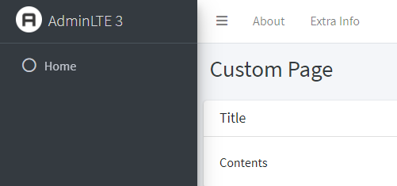
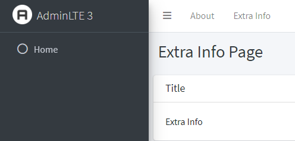
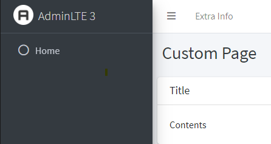

# Navbar Left Injectable Menu

Each page can add a custom top left menu using a DI injectable.

### Startup.cs

The injectable is configured using an addscoped simply by adding this line in your configure services startup.

```CSharp
public void ConfigureServices(IServiceCollection services)
{
    ...
    services.AddAdminLte();
}

```

### MainLayout.razor

In the main layout you indicate where you want the navbar to appear. You can choose to specify a global
menu here. Notice the OverrideParentContent property on the injectable. If set to true in any other
page, in this case the About menu will not get rendered, this allowing you to override the main layout
menu if so desired.

```html
@inherits LayoutComponentBase
@inject NavigationManager NavigationManager
@inject IJSRuntime JS
@inject NavBarLeftInjectableMenu navBarLeftInjectableMenu
@inject ILayoutManager layoutManager 
<NavBar>
    <NavBarLeft>
        @if (!navBarLeftInjectableMenu.OverrideParentContent)
        {
            // Put your global menu here
            <NavBarMenuItem Link="/About">About</NavBarMenuItem>
        }
        @navBarLeftInjectableMenu.content <!-- Injectable for custom menu content per page -->
    </NavBarLeft>
</NavBar>
```

### CustomMenu.razor

Lets create a custom menu.

```html
<NavBarMenuItem Link="/extra-info">Extra Info</NavBarMenuItem>
```

### CustomPage.razor

Lets make a Custom page, that consumes the custom menu item and place it next to the default
about menu item.

```html
@page "/custom-page"
@inject NavBarLeftInjectableMenu menu

@menu.SetContent(@<CustomMenu />)
<ContentHeader>
    <Header>
        <PageTitle Title="Custom Page" />
    </Header>
</ContentHeader>
<ContentMain>
    <Card>
        <Title><CardTitle>Title</CardTitle></Title>
        <Body>
            Contents
        </Body>
    </Card>
</ContentMain>
```

### ExtraInfo.razor

Now create an extra info page, which you can select from the CustomPage.razor menu. Note that
we repeat the injectable

```html
@page "/extra-info"
@inject NavBarLeftInjectableMenu menu

@menu.SetContent(@<CustomMenu />)
<ContentHeader>
    <Header>
        <PageTitle Title="Extra Info Page" />
    </Header>
</ContentHeader>
<ContentMain>
    <Card>
        <Title><CardTitle>Title</CardTitle></Title>
        <Body>
            Extra Info
        </Body>
    </Card>
</ContentMain>
```

Now, in your browser, navigate to:

```
/custom-page
```

On the custom page you will see the custom menu rendered next to the about menu item (coming from Mainlayout.cs)



Now navigate to the Extra Info page and you will see, the same menu rendered again



### Override MainLayout menu

Now alter the CustomPage.razor:

```html
@menu.SetContent(@<CustomMenu /> )
```

And set override parent content to true:

```html
@menu.SetContent(@<CustomMenu />,true )

```

Now Navigate again to:

```
/custom-page
```

The about menu will have disapeared



**!Note**, when again visiting the Extra Info page, the about menu will appear again. You can also 
override the parent content in the Extra Info page if so desired.

