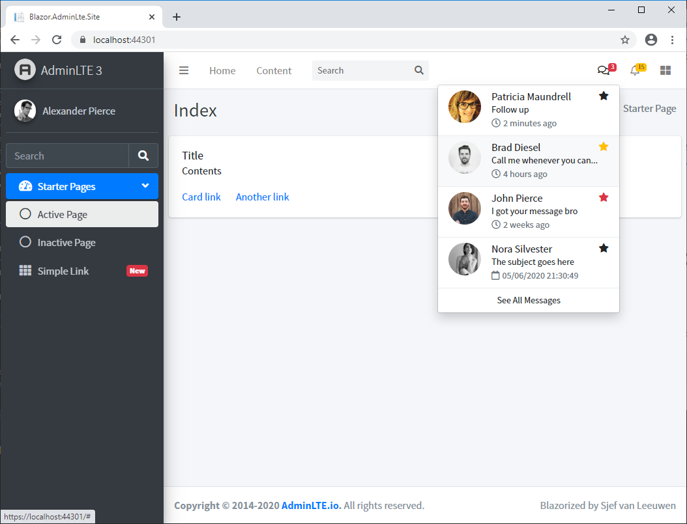



[](https://www.nuget.org/packages/Blazorized.AdminLte/)
[](https://github.com/sjefvanleeuwen/blazor-adminlte/actions)

# What is it?

ADMINLTE for Blazor is a collection of reusable components, with which you can easily develop digital services as a designer or developer. Think of buttons, form elements and page templates. This project adapts ADMINLTE 3 so the components can be used from dotnet core Blazor.

For a quick impression visite the **demo site** at: https://blazorize-adminlte.morstead.nl/

# Status

The project is in early stage currently, but expanded almost daily. Feel free to follow the project and receive updates as they arrive.
**Note** that components and their naming conventions might change until a major version is released.

We also provide various integrations in a seperate project, to help you started with more complex web applications Here:

https://github.com/sjefvanleeuwen/blazorized-adminlte-plugins

# Installation

## Nuget

Start a new Blazor APP and simply install the nuget package.

```
Install-Package Blazorized.AdminLte
```
or visit https://www.nuget.org/packages/Blazorized.AdminLte/ for more installation options.

If you want to include the current supported ADMINLTE 3.0.5 static css / js / icons content etc.:

```
Install-Package Blazorized.AdminLte.Content -Version 3.0.5
```
or visit https://www.nuget.org/packages/Blazorized.AdminLte.Content/ for more installation options.

## Index

Depending on running WASM or Server, change your `index.html` or `_Host.cshtml`. 
Contents from the Blazor Component Library are served from : `_content/Blazor.AdminLte`

As a starting point:

```html
<!DOCTYPE html>
<html lang="en">
<head>
    <meta charset="utf-8" />
    <meta name="viewport" content="width=device-width, initial-scale=1.0" />
    <title>Blazor.AdminLte.Site</title>
    <base href="~/" />
    <!-- Google Font: Source Sans Pro -->
    <link rel="stylesheet" href="https://fonts.googleapis.com/css?family=Source+Sans+Pro:300,400,400i,700&display=fallback">
    <!-- Font Awesome Icons -->
    <link rel="stylesheet" href="_content/Blazor.AdminLte/plugins/fontawesome-free/css/all.min.css">
    <!-- Theme style -->
    <link rel="stylesheet" href="_content/Blazor.AdminLte/dist/css/adminlte.min.css">
    <link href="css/site.css" rel="stylesheet" />
</head>
<body class="hold-transition sidebar-mini">
    <div class="wrapper">
        <app>
            <component type="typeof(App)" render-mode="ServerPrerendered" />
        </app>
        <div id="blazor-error-ui">
            <environment include="Staging,Production">
                An error has occurred. This application may no longer respond until reloaded.
            </environment>
            <environment include="Development">
                An unhandled exception has occurred. See browser dev tools for details.
            </environment>
            <a href="" class="reload">Reload</a>
            <a class="dismiss">🗙</a>
        </div>
    </div>
    <script src="_framework/blazor.server.js"></script>
    <!-- jQuery -->
    <script src="_content/Blazor.AdminLte/plugins/jquery/jquery.min.js"></script>
    <!-- Bootstrap 4 -->
    <script src="_content/Blazor.AdminLte/plugins/bootstrap/js/bootstrap.bundle.min.js"></script>
    <!-- AdminLTE App -->
    <script src="_content/Blazor.AdminLte/dist/js/adminlte.min.js"></script>
</body>
</html>
```

The example includes markup that shows how to setup your starter page in Blazor.


```html
@inherits LayoutComponentBase
@inject NavigationManager NavigationManager
<NavBar>
    <NavBarLeft>
        <NavBarMenuItem Link="/">Home</NavBarMenuItem>
        <NavBarMenuItem>Content</NavBarMenuItem><!-- defaults to # -->
    </NavBarLeft>
    <NavBarSearch></NavBarSearch>
    <NavBarRight>
        <NavBarDropDown>
            <NavBarBadge Color="Color.Danger" Icon="far fa-comments">3</NavBarBadge>
            <NavBarDropDownMenu>
                <NavBarDropDownMenuItem>
                    <UserMessage DateTime="DateTime.Now.AddMinutes(-2)" ProfilePicture="dist/img/user7-128x128.jpg" Icon="fas fa-star">
                        <UserName>Patricia Maundrell</UserName>
                        <Message>Follow up</Message>
                    </UserMessage>
                </NavBarDropDownMenuItem>
                <DropdownDivider />
                <NavBarDropDownMenuItem>
                    <UserMessage DateTime="DateTime.Now.AddHours(-4)" ProfilePicture="dist/img/user1-128x128.jpg" Icon="fas fa-star" IconColor="Color.Warning">
                        <UserName>Brad Diesel</UserName>
                        <Message>Call me whenever you can...</Message>
                    </UserMessage>
                </NavBarDropDownMenuItem>
                <DropdownDivider />
                <NavBarDropDownMenuItem>
                    <UserMessage DateTime="DateTime.Now.AddDays(-8)" ProfilePicture="dist/img/user8-128x128.jpg" Icon="fas fa-star" IconColor="Color.Danger">
                        <UserName>John Pierce</UserName>
                        <Message>I got your message bro</Message>
                    </UserMessage>
                </NavBarDropDownMenuItem>
                <DropdownDivider />
                <NavBarDropDownMenuItem>
                    <UserMessage DateTime="DateTime.Now.AddDays(-31)" ProfilePicture="dist/img/user3-128x128.jpg" Icon="fas fa-star">
                        <UserName>Nora Silvester</UserName>
                        <Message>The subject goes here</Message>
                    </UserMessage>
                </NavBarDropDownMenuItem>
                <DropdownDivider />
                <DropdownFooter OnClick="SeeAllMessages">See All Messages</DropdownFooter>
            </NavBarDropDownMenu>
        </NavBarDropDown>
        <NavBarDropDown>
            <NavBarBadge Color="Color.Warning" Icon="far fa-bell">15</NavBarBadge>
            <NavBarDropDownMenu>
                <DropdownHeader>15 Notifications</DropdownHeader>
                <DropdownDivider></DropdownDivider>
                <NotificationMessage DateTime="@DateTime.Now.AddMinutes(-3)" Icon="fas fa-envelope mr-2">
                    <Message>4 new messages</Message>
                </NotificationMessage>
                <DropdownDivider></DropdownDivider>
                <NotificationMessage DateTime="@DateTime.Now.AddHours(-12)" Icon="fas fa-users mr-2">
                    <Message>8 friend requests</Message>
                </NotificationMessage>
                <DropdownDivider></DropdownDivider>
                <NotificationMessage DateTime="@DateTime.Now.AddDays(-2)" Icon="fas fa-file mr-2">
                    <Message>3 new reports</Message>
                </NotificationMessage>
                <DropdownDivider></DropdownDivider>
                <DropdownFooter OnClick="SeeAllNotifications">See All Notifications</DropdownFooter>
            </NavBarDropDownMenu>
        </NavBarDropDown>
        <NavBarSideBarControl></NavBarSideBarControl>
    </NavBarRight>
</NavBar>
<SideBarContainer>
    <BrandLogo Link="https://adminlte.io/" Logo="dist/img/AdminLTELogo.png">AdminLTE 3</BrandLogo>
    <SideBar>
        <!-- Sidebar user panel (optional) -->
        <SideBarUserPanel UserImage="dist/img/user2-160x160.jpg">Alexander Pierce</SideBarUserPanel>
        <SideBarSearch></SideBarSearch>
        <SideBarMenu>
            <SideBarTreeView MenuState="MenuState.Open" Icon="fas fa-tachometer-alt">
                <Title>Starter Pages</Title>
                <Items>
                    <SideBarMenuItem Icon="far fa-circle" NavLinkState="NavLinkState.Active">
                        Active Page
                    </SideBarMenuItem>
                    <SideBarMenuItem Icon="far fa-circle">
                        Inactive Page
                    </SideBarMenuItem>
                </Items>
            </SideBarTreeView>
            <SideBarMenuItem Icon="fas fa-th">
                Simple Link
                <span class="right badge badge-danger">New</span>
            </SideBarMenuItem>
        </SideBarMenu>
    </SideBar>
</SideBarContainer>
<ContentWrapper>
    @Body
</ContentWrapper>
<ControlSideBar>Hello World!</ControlSideBar>
<MainFooter>
    <Default>
        <strong>Copyright &copy; 2014-2020 <a href="https://adminlte.io">AdminLTE.io</a>.</strong> All rights reserved.
    </Default>
    <Right>
        Blazorized by Sjef van Leeuwen
    </Right>
</MainFooter>
@code {
    private void SeeAllMessages(MouseEventArgs args)
    {
        NavigationManager.NavigateTo("see-all-messages");
    }

    private void SeeAllNotifications(MouseEventArgs args)
    {
        NavigationManager.NavigateTo("see-all-notifications");
    }
}
```

With such markup you can render something like this:


